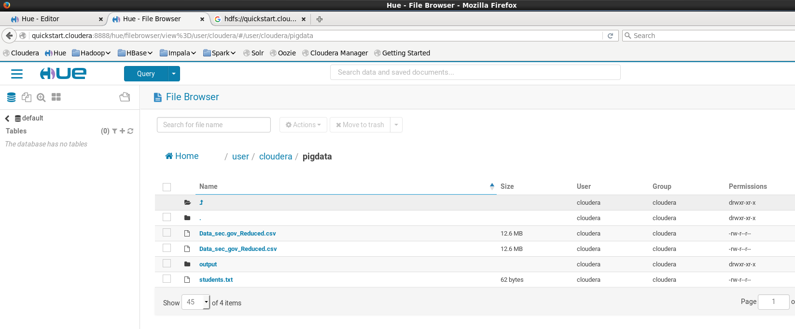
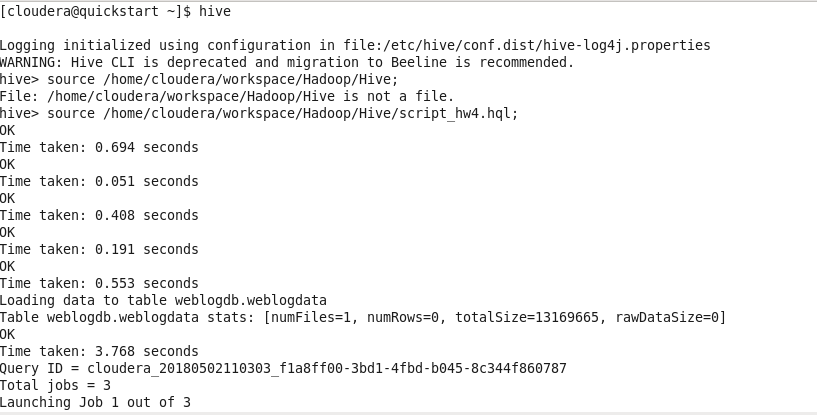
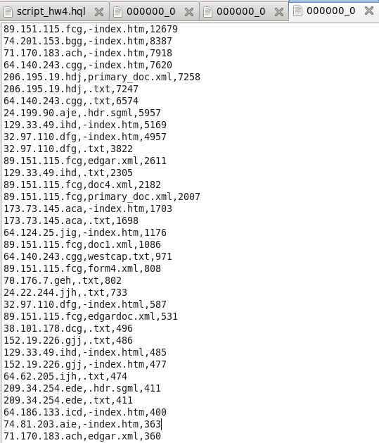

# HiveQL script - weblog data analysis


## Description
The script has the goal of analyzing weblog data of users and their internet searches.


## Dataset
The dataset used for the aalysis is based on a subset of public data from the website sec.gov 
[(link to dataset)](https://www.sec.gov/dera/data/edgar-log-file-data-set.html); it includes information on internet search traffic for EDGAR filings through SEC.gov generally covering the period February 14, 2003 through June 30, 2017.

The focus is on data from September 2010.


## Environment and implementation
The script was built and run on a Cloudera Quickstart virtual machine installed on VirtualBox. The VM has a single node cluster with installed Hadoop HDFS.

It also provides a web interface to develop scripts for different frameworks and manage HDFS.



Hive is pre-installed and quicly accessible through the CLI.


## Query explaination
1. Compute the total number of requests and byte for IP;
2. Determine the number of requests for file to find the most request one;
3. Group the result for IP and file to compute the number of requests to a specific file from a specific IP.

All results are sorted descendent.


## Execution from terminal
Script has been run with Hive CLI; after exporting the dataset to HDFS, the command run was ```source /home/cloudera/workspace/Hadoop/Hive/script.hql```.



The script produced three outputs.




