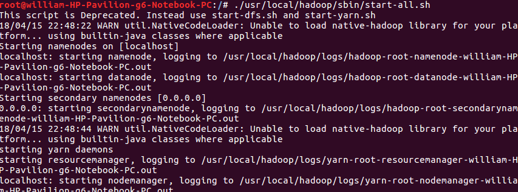
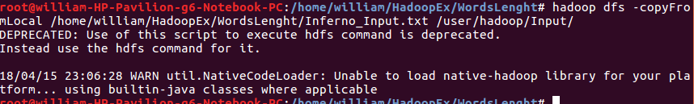
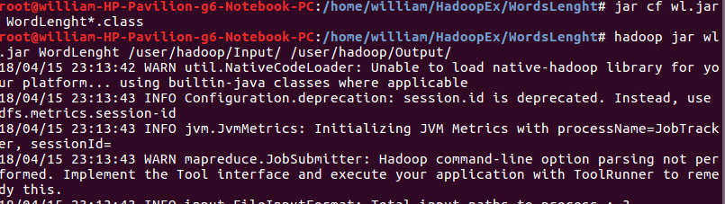
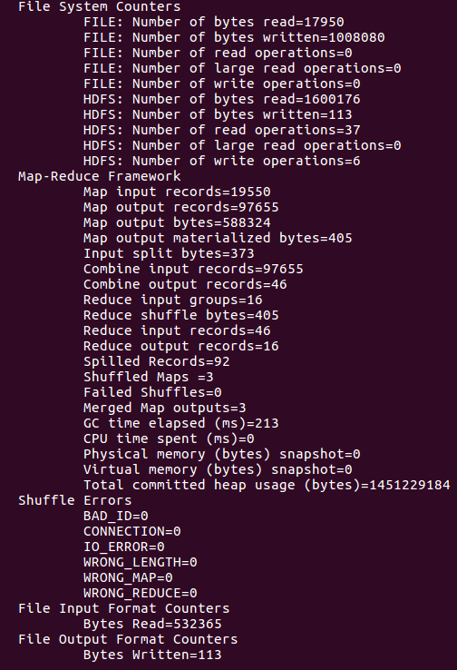
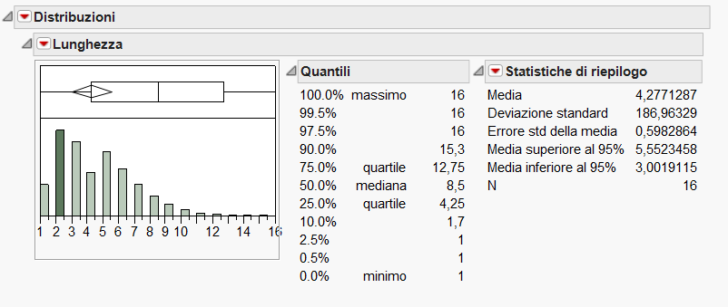
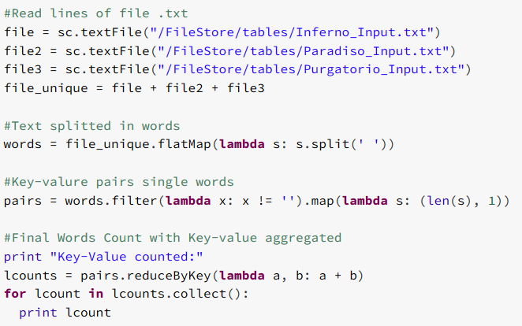
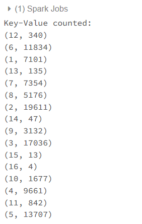

# MapReduce script - Word length count

## Description
The script compute the average, the median and the standard deviation of words length from an input file.

## Input file
The file used is the _Divina Commedia_ from Dante Alighieri. The specific parts are divided into three .txt files:
- Inferno;
- Purgatorio;
- Paradiso.

## Environment and implementation
The script has been runnin on Hadoop 2.6.0 installed on Ubuntu 16.06 LTS in _Pseudo-Distributed_ mode. This mode simulate a cluster with 2 nodes, master and slave, through the JVM. 

## Code
### Map
The key specified is *length*, the length extracted from the Tokenizer. Prior to this there is a pre-processing step, where special chars are remvoed or replaced.

### Reduce
In this phase is performed a simple sum of the values.

### Main
In the main all the paraeters and values of the Job are set; the Reducer is exactly as the Reducer.

## Execution from terminal
The steps needed to run the script are:
1. Start Hadoop Namenode, Datanodes, Jobtracker and Tasktracker using the _start_all.sh_ script;

2. Import into the HDFS the .txt files for input and the .java file containing the script;

3. Generate the .jar from the .java script file and run it.

4. The output .txt file will contain the couple word - length. The file needs to be imported locally.

## Results
A further analysis on the result was performed.

## Databricks
Alternative execution to achieve same result can be done in Databrick using Spark. Created a cluster in cloud and a Notebook, the following code results equivalent to the .java one.

